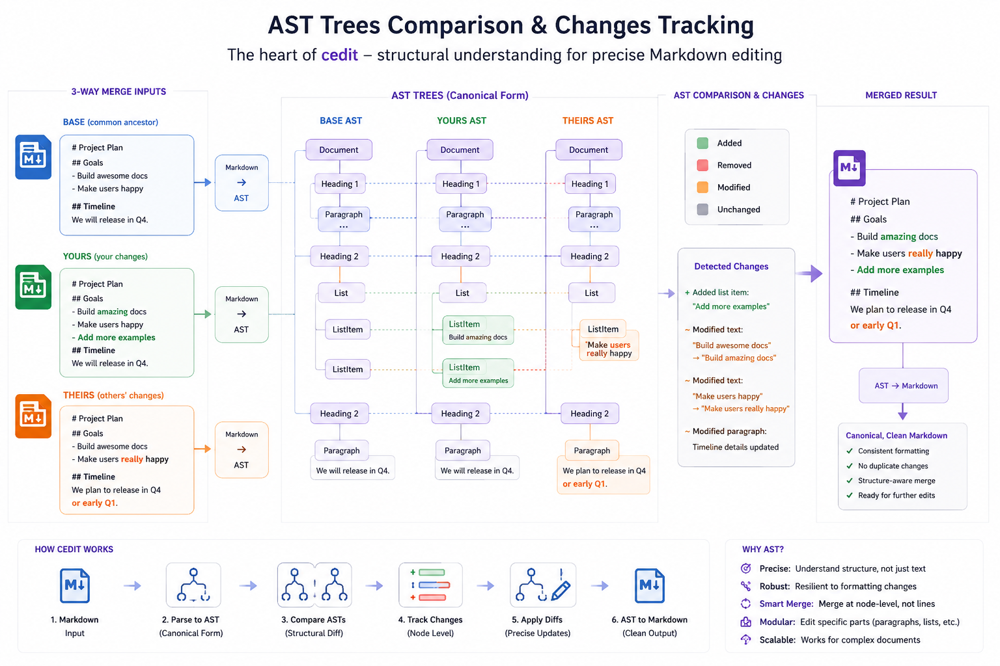

# `cedit` user guide

A practical guide to `cedit/cli.py`, the command line that keeps your local
adaptations of vendored Markdown alive across upstream updates. This is the
*how-to*: worked examples, real output, and the flows you will actually run.
For the *why* behind the design, read [SPEC.md](SPEC.md); for a two-minute
overview, [README.md](README.md).

Every command and every block of output below was run for real — against this
repository or a throwaway directory — and pasted unedited.



**Contents**

1. [The mental model](#1-the-mental-model)
1. [Prerequisites](#2-prerequisites)
1. [The five subcommands](#3-the-five-subcommands)
1. [Five-minute tour](#4-five-minute-tour)
1. [Command reference](#5-command-reference)
1. [What cedit sees: blocks, hashes, keys](#6-what-cedit-sees-blocks-hashes-keys)
1. [The merge matrix in practice](#7-the-merge-matrix-in-practice)
1. [Flow: vendoring a document](#8-flow-vendoring-a-document)
1. [Flow: taking an upstream update](#9-flow-taking-an-upstream-update)
1. [Flow: a conflict, end to end](#10-flow-a-conflict-end-to-end)
1. [What alignment buys you](#11-what-alignment-buys-you)
1. [The `.cedit/` state directory](#12-the-cedit-state-directory)
1. [Limits, stated plainly](#13-limits-stated-plainly)
1. [Cookbook](#14-cookbook)
1. [Troubleshooting](#15-troubleshooting)
1. [Appendix](#16-appendix)

______________________________________________________________________

## 1. The mental model

Five commands over one tracked document:

```
   snapshot ──►  (you edit the file)  ──►  sync  ──►  (clean)
      │                   │                  │
      │                 diff                 └─► conflict ──► resolve ──► sync
      │            what have I changed?
      └─ start tracking                    status  (read-only, any time)
```

Three ideas explain almost everything.

**Three revisions, one merge.** Every tracked document has a *base* (**B**, the
upstream revision you last synced against, snapshotted under `.cedit/base/`), a
*local* copy (**L**, the file you edit in place), and an *upstream* (**U**, the
new revision you hand to `sync`). `sync` aligns L against B to learn what you
changed, aligns U against B to learn what upstream changed, and decides every
block by crossing the two. The merged document is always **U's structure** with
your texts spliced in.

**Blocks are content-addressed, and fences count.** A "block" is a paragraph, a
heading, a table cell — or a code fence, a raw HTML block, or the YAML front
matter. Its identity is a 16-hex-char Merkle hash of its canonical content, not
its position or line number. That is why a rewritten fence is a first-class
edit, why an upstream *move* of a block you edited costs nothing, and why
rewrapping a paragraph at a different width changes nothing at all.

**Nothing is ever silently clobbered.** When upstream changes the very block you
adapted, the working file keeps **your** text and the conflict is recorded with
all three versions. The document then refuses to sync again until you settle it
with `resolve`. There are no conflict markers in the file — `=======` is a
setext heading underline, so a marked-up Markdown file would stop parsing as the
document it was; conflicts live in `.cedit/manifest.json` instead.

______________________________________________________________________

## 2. Prerequisites

cedit runs from the root of the repository that holds your vendored copies —
a *different* repository from the one cedit itself lives in. Install it once:

```bash
pipx install cedit   # or: pip install cedit
cedit --help
```

Every example below is written as `cedit <subcommand>`. `python3 -m cedit
<subcommand>` is the same entry point with the same arguments, so use
whichever you prefer — the module form is what you want when cedit is
installed in a virtualenv you'd rather not activate:
`/path/to/venv/bin/python3 -m cedit …`.

**Install cedit into an environment of its own.** `pipx` above does that for
you; a dedicated virtualenv does the same. The reason is the pins below:
`mdcore/utils.make_parser` appends *every installed* mdformat parser
extension, so the set of mdformat plugins in the environment is part of the
parser identity. A shared environment carrying other mdformat plugins can
move the hashes in your `.cedit/` state even though cedit's own pinned
dependencies were honoured.

Working on cedit itself rather than using it? Install from a clone instead:

```bash
python3 -m venv venv
venv/bin/pip install -r requirements.txt   # the parsing stack, pinned EXACTLY
venv/bin/pip install -e .                  # puts `cedit` on the venv's path
venv/bin/python3 -m pytest                 # 31 tests, no network, <1s
```

**The pins are load-bearing.** `requirements.txt` pins `markdown-it-py`,
`mdit-py-plugins`, `mdformat`, `mdformat-gfm`, `mdformat-frontmatter` and
`linkify-it-py` to exact versions. Every hash in `.cedit/` — base document
hashes, overlay keys, conflict keys — is taken over that one parser
configuration. A minor upgrade can change what the parser emits, which silently
moves every hash and turns your next sync into a wall of false conflicts.
Upgrade one pin at a time and run the suite.

**Run from the repository root.** Tracked documents are addressed by a path
relative to the root, and the state directory is resolved from the working
directory. Running from a subdirectory does not error — it just finds no state:

```console
$ cd sub && cedit status
nothing tracked
```

cedit never fetches anything. Getting upstream onto your disk — a git submodule,
a subtree, `curl`, a vendoring script — is your transport. `--from` takes a
directory that mirrors your document paths, or a single file.

______________________________________________________________________

## 3. The five subcommands

| Command | Reads | Writes | Exit codes |
| --- | --- | --- | --- |
| `snapshot` | the upstream file, the working copy if it exists | the working copy (if absent), `.cedit/` | 0, 2 |
| `diff` | base snapshot, working copy | nothing | 0, 2 |
| `sync` | base snapshot, working copy, upstream | the working copy, `.cedit/` | 0, 1, 2 |
| `status` | base snapshot, working copy, manifest | nothing | 0, 1, 2 |
| `resolve` | manifest, working copy | the working copy (`--take upstream` only), `.cedit/` | 0, 2 |

`diff` and `status` are read-only and safe at any moment. `sync` is the only
command that merges. `resolve` is the only command that can clear a conflict.

______________________________________________________________________

## 4. Five-minute tour

A complete round trip in a throwaway directory: vendor a skill, adapt it, take
two upstream revisions, hit a conflict, settle it. Copy-paste each block in
order, with the venv activated.

````bash
mkdir -p /tmp/cedit-tour/vendor/skills && cd /tmp/cedit-tour

cat > vendor/skills/deploy.md <<'EOF'
# Deploy skill

This skill takes a build from the artifact store and puts it on staging.

## Preflight

Run the healthcheck before anything else:

```bash
bash scripts/healthcheck.sh --strict
```

## Deploy

```bash
bash scripts/deploy.sh --env staging
```
EOF

cedit snapshot skills/deploy.md --from vendor/skills/deploy.md
````

```console
skills/deploy.md: tracking (base 9ef5a0dbdc298d85, from vendor/skills/deploy.md), 0 local edit(s) recorded
```

`vendor/` is your upstream mirror; `skills/deploy.md` is the document you are
going to own. It did not exist, so `snapshot` vendored it — the working copy now
holds the canonicalized upstream text, and `.cedit/` holds the base snapshot the
merge will remember.

Now adapt it. Your environment has no `bash`, so rewrite the healthcheck fence:

```bash
perl -0pi -e 's/```bash\nbash scripts\/healthcheck/```zsh\nzsh scripts\/healthcheck/' skills/deploy.md
cedit diff
```

```console
skills/deploy.md: 1 local edit(s)
[edit opaque fence] #7b47884c75de548e:0  sim=0.93
    ctx  : Preflight
    info : bash -> zsh
    base : bash scripts/healthcheck.sh --strict
    local: zsh scripts/healthcheck.sh --strict

```

One edit, on one fence, at one address. The `info : bash -> zsh` line is the
fence's info string — the ```` ```bash ```` marker itself is part of what you
edited, not decoration around it.

Upstream evolves: the intro gets a sentence, and the *other* fence gains a flag.

```bash
sed -i 's/puts it on staging./puts it on staging, then promotes it to production./' vendor/skills/deploy.md
sed -i 's/deploy.sh --env staging/deploy.sh --env staging --wait/' vendor/skills/deploy.md
cedit sync --from vendor
```

```console
skills/deploy.md: 1 edit(s) reapplied, 2 block(s) updated from upstream, no conflicts
```

Read that as: your zsh rewrite went back in, upstream's two changes came through,
nobody stepped on anybody. The file now has upstream's new prose, upstream's
`--wait`, and your `zsh` fence.

Now the interesting case. Upstream touches the very fence you rewrote:

```bash
sed -i 's/healthcheck.sh --strict/healthcheck.sh --strict --timeout 60/' vendor/skills/deploy.md
cedit sync --from vendor
echo "rc=$?"
```

```console
skills/deploy.md: 0 edit(s) reapplied, 0 block(s) updated from upstream, 1 conflict(s)
[CONFLICT opaque fence] #7b47884c75de548e:0
    ctx     : Preflight
    base    : bash scripts/healthcheck.sh --strict
    upstream: bash scripts/healthcheck.sh --strict --timeout 60
    local   : zsh scripts/healthcheck.sh --strict  (kept in the working file)
    resolve : cedit resolve skills/deploy.md 7b47884c75de548e:0 --take local|upstream

rc=1
```

Exit code 1 — "a human is needed", distinct from 2, "something is broken". Your
zsh line is still in the file; upstream's version is recorded, not applied. Keep
the adaptation:

```bash
cedit resolve skills/deploy.md 7b47884c75de548e --take local
cedit sync --from vendor
cedit status
```

```console
skills/deploy.md #7b47884c75de548e:0: kept local text — it is now an ordinary overlay edit against the new base
skills/deploy.md: up to date
skills/deploy.md: 1 local edit(s), 0 unresolved conflict(s); base d47b5d46bb5134d8 synced 2026-08-05T00:01:42Z (upstream: vendor)
```

That last state is the whole point. You did not just dismiss a conflict — the
adaptation was **re-keyed to the new upstream block**, so it is an ordinary
overlay edit again, and the next upstream revision that leaves that fence alone
will re-apply it without asking. This is the `git rerere` move.

______________________________________________________________________

## 5. Command reference

### 5.1 Global options

One global flag, and it goes **before** the subcommand:

| Flag | Default | Meaning |
| --- | --- | --- |
| `--state-dir` | `.cedit` | state directory, relative to the working directory |
| `-h`, `--help` | — | usage; also available per subcommand |

```console
$ cedit --help
usage: cedit [-h] [--state-dir STATE_DIR]
             {snapshot,diff,sync,status,resolve} ...

Keep local adaptations of vendored Markdown alive across upstream updates (see
SPEC.md).

positional arguments:
  {snapshot,diff,sync,status,resolve}
    snapshot            start tracking a document
    diff                show local edits against the base
    sync                3-way merge a new upstream revision in
    status              per-document overlay/conflict summary
    resolve             settle one recorded conflict

options:
  -h, --help            show this help message and exit
  --state-dir STATE_DIR
                        state directory (default: .cedit)
```

`--state-dir` gives you a second, independent set of tracking state over the
same files — useful for a dry experiment you do not want in the committed
`.cedit/`:

```console
$ cedit --state-dir .cedit-alt status
nothing tracked
```

### 5.2 `snapshot`

Start tracking one document. Run once per document, ever.

```bash
cedit snapshot skills/deploy.md --from vendor/skills/deploy.md
```

| Flag | Default | Meaning |
| --- | --- | --- |
| `doc` | — | positional, required: the document path, relative to the repo root |
| `--from` | — | **required**: the upstream *file* this copy is based on |

Two cases, and `snapshot` picks between them by whether the document already
exists on disk:

- **It does not exist** — the initial vendoring. The canonicalized upstream text
  is written as the working copy, and zero edits are recorded.
- **It exists** — you adapted your vendored copy before ever using cedit. The
  file is left exactly as it is, and the difference against upstream is recorded
  as your overlay:

```console
$ cedit snapshot G.md --from vendor/G.md
G.md: tracking (base 7f3d2b74871ef834, from vendor/G.md), 1 local edit(s) recorded
$ cedit diff
G.md: 1 local edit(s)
[edit opaque fence] #a77bdf7f48c7f708:0  sim=0.80
    ctx  : G
    info : bash -> zsh
    base : bash run.sh
    local: zsh run.sh
```

The line reads `tracking (base <doc-hash>, from <path>), N local edit(s)
recorded`. The doc hash is the Merkle root of the canonicalized base — the same
value `status` reports later, and the thing that tells you two documents are
literally the same revision.

`--from` here is a **file**, not a directory: this is the one command that has
no per-document path convention to lean on. The path is recorded in the manifest
and becomes the default `--from` for later syncs.

Snapshotting twice is an error, not a re-vendoring:

```console
$ cedit snapshot A.md --from vendor/A.md
A.md: already tracked — use `cedit sync` to take a new upstream revision
```

### 5.3 `diff`

Show what you have changed, relative to the base snapshot. Reads nothing but
`.cedit/base/` and your working copy; writes nothing at all.

```bash
cedit diff                      # every tracked document
cedit diff skills/deploy.md     # one document
cedit diff --unified            # git-style, for reviewers
```

| Flag | Default | Meaning |
| --- | --- | --- |
| `docs...` | every tracked document | positional, repeatable: which documents to report |
| `--unified` | off | plain unified diff of canonical base vs. working copy |

The default view is per block:

```console
skills/deploy/SKILL.md: 1 local edit(s)
[edit opaque fence] #7b47884c75de548e:0  sim=0.93
    ctx  : Preflight
    info : bash -> zsh
    base : bash scripts/healthcheck.sh --strict
    local: zsh scripts/healthcheck.sh --strict
```

Line by line:

- **`<doc>: N local edit(s)`** — the count, followed by ` — in sync with base`
  when it is zero.
- **`[edit <kind> <node_type>] #<hash>:<occurrence>`** — `kind` is `opaque` (a
  fence, raw HTML, front matter, a horizontal rule) or `unit` (a heading,
  paragraph, or table cell). `node_type` is the markdown-it node. The `#…:…`
  part is the block's **address in the base**: content hash plus occurrence
  index. That address is what you pass to `resolve`.
- **`sim=0.93`** — how similar the two texts are, 0…1. It is omitted entirely
  when the score is 0, which happens on short blocks paired on *positional*
  evidence rather than textual similarity (see [§11](#11-what-alignment-buys-you)):

```console
G.md: 1 local edit(s)
[edit unit td] #5c6f9f76aa6e8e7f:0
    ctx  : G
    base : you
    local: the release manager
```

- **`ctx :`** — the heading trail above the block, joined with ` › `. This is
  how you find the block in a long document.
- **`info :`** — printed only when the fence info string changed, as
  `bash -> zsh`. The info string is part of the edited surface, which is why
  ```` ```bash ```` → ```` ```zsh ```` is a real edit and not a no-op.
- **`base :` / `local:`** — the two texts, clipped to 110 characters *around
  their first difference*, so an edit deep in a long block is still visible.

`--unified` gives reviewers the familiar syntax. It is a rendering of the same
overlay, never the stored form:

````console
$ cedit diff --unified
--- base/skills/deploy/SKILL.md
+++ skills/deploy/SKILL.md
@@ -11,8 +11,8 @@
 
 Run the healthcheck before anything else:
 
-```bash
-bash scripts/healthcheck.sh --strict
+```zsh
+zsh scripts/healthcheck.sh --strict
 ```
 
 If it exits non-zero, stop and fix the environment first.
````

`--unified` also keeps working when the block view cannot run — it compares text,
so a structural local change (§13) does not stop it. That makes it the tool for
*seeing* the drift the block view refuses to merge.

### 5.4 `sync`

The 3-way merge: take a new upstream revision, re-apply your overlay on top.

```bash
cedit sync --from vendor              # every tracked doc, upstream dir
cedit sync skills/deploy.md --from vendor/skills/deploy.md
cedit sync --from vendor --dry-run    # report, write nothing
cedit sync                            # each doc's recorded upstream
```

| Flag | Default | Meaning |
| --- | --- | --- |
| `docs...` | every tracked document | positional, repeatable: which documents to sync |
| `--from` | each document's recorded upstream | upstream **directory** (mirroring document paths) or a single **file** |
| `-n`, `--dry-run` | off | merge and report, write nothing |

`--from` resolution, per document: a directory is joined with the document's own
relative path (`vendor` + `skills/deploy.md` → `vendor/skills/deploy.md`); a file
is used as-is. Passing a file while several documents are in scope is refused,
because one file cannot be the upstream of two documents:

```console
$ cedit sync --from vendor/skills/A.md
--from is a file but several documents are being synced — pass a directory, or one document
$ cedit sync skills/A.md --from vendor/skills/A.md
skills/A.md: up to date
```

Whatever you pass is **recorded** as that document's upstream and becomes the
default for the next bare `sync`.

The report line is one per document. When upstream's canonical text equals the
base, nothing is computed at all:

```console
skills/A.md: up to date
skills/B.md: 1 edit(s) reapplied, 1 block(s) updated from upstream, no conflicts
```

The counters, in the order they can appear:

| Counter | Counts |
| --- | --- |
| `N edit(s) reapplied` | your edits that were spliced into upstream's tree |
| `N block(s) updated from upstream` | blocks upstream changed that you had not touched |
| `N inserted` | blocks upstream added (omitted when zero) |
| `N removed` | blocks upstream deleted that you had not touched (omitted when zero) |
| `N moved` | blocks upstream moved without changing (omitted when zero) |
| `N conflict(s)` / `no conflicts` | blocks both sides changed, plus orphans |

Blocks nobody touched are not reported at all, so a revision that only reflows
text reports zeros across the board. A dry run appends its own marker:

```console
skills/deploy/SKILL.md: 1 edit(s) reapplied, 2 block(s) updated from upstream, no conflicts [dry run — nothing written]
```

`--dry-run` writes nothing whatsoever — not the working copy, not the base
snapshot, not the manifest. Use it to see what an upstream revision would do
before you let it near a dirty working tree.

Every conflict is then printed in full (see [§10](#10-flow-a-conflict-end-to-end)),
and the command exits 1. Errors — an upstream file that does not exist, a
document with conflicts still open, a local structural change — exit 2, and 2
wins over 1 when a run hits both.

**Write ordering.** The working file is written *before* the base snapshot and
manifest, deliberately. A crash between the two leaves an already-merged working
copy against the old base, which the next sync simply re-derives as local edits
and converges on. The reverse order would record a sync that never happened.

### 5.5 `status`

Per-document summary. Read-only, no upstream needed, safe at any time — this is
the command a CI job runs.

```bash
cedit status
cedit status skills/deploy.md
```

| Flag | Default | Meaning |
| --- | --- | --- |
| `docs...` | every tracked document | positional, repeatable: which documents to report |

```console
$ cedit status
skills/A.md: 1 local edit(s), 0 unresolved conflict(s); base 191ead45bd56de1e synced 2026-08-05T00:00:20Z (upstream: vendor/skills/A.md)
skills/B.md: 1 local edit(s), 0 unresolved conflict(s); base 8949953623be4edb synced 2026-08-05T00:00:20Z (upstream: vendor/skills/B.md)
```

- **`N local edit(s)`** — recomputed live from the base and your working copy,
  not read from `overlay.json`. It is always current, even if you edited the file
  five seconds ago.
- **`N unresolved conflict(s)`** — read from the manifest. Any document with a
  non-zero count makes the command exit **1**.
- **`base <hash> synced <timestamp>`** — which upstream revision you are merged
  against, and when. Two checkouts reporting the same base hash for a document
  are on the same upstream revision.
- **`(upstream: …)`** — the recorded `--from`, or `unset`.

With nothing tracked at all, `status` is a clean no-op — exit **0**, unlike
`diff` and `sync`, which treat it as an error:

```console
$ cedit status
nothing tracked
```

A document with a local structural change reports that in place of the edit
count — and, note, does **not** change the exit code:

```console
$ cedit status; echo "rc=$?"
skills/deploy/SKILL.md: STRUCTURAL DRIFT (see `cedit diff`), 0 unresolved conflict(s); base 1325c1dfe3186353 synced 2026-08-04T23:58:47Z (upstream: vendor/skills/deploy/SKILL.md)
rc=0
```

Only conflicts drive exit 1. If you gate CI on drift as well, grep the output
for `STRUCTURAL DRIFT` or run `diff`, which exits 2 on it.

### 5.6 `resolve`

Settle exactly one recorded conflict.

```bash
cedit resolve skills/deploy.md 7b47884c75de548e --show
cedit resolve skills/deploy.md 7b47884c75de548e --take local
cedit resolve skills/deploy.md 7b47884c75de548e:0 --take upstream
```

| Flag | Default | Meaning |
| --- | --- | --- |
| `doc` | — | positional, required: the document |
| `key` | — | positional, required: conflict key — `<hash>` or `<hash>:<occurrence>` |
| `--take` | none | `local` keeps your text, `upstream` splices upstream's |
| `--show` | off | print all three versions in full, change nothing |

**The key** is what `sync` printed on the conflict line, `<hash>:<occurrence>`.
Any unambiguous prefix works, so the bare hash is normally enough. Ambiguity is
refused rather than guessed:

```console
$ cedit resolve G.md f --take local
'f' is ambiguous: f78f8a455566e4e5:0, f86b66327dc68b6d:0
$ cedit resolve skills/deploy/SKILL.md 5 --take local
no conflict matches '5' (open ones: 2a37ee9b554dd0c8:0)
```

**`--show`** (and a bare `resolve` with no `--take`, which does the same) prints
the three versions unclipped, so you can read a long block in full before
deciding:

```console
$ cedit resolve GUIDE.md 7b47884c75de548e --show
[CONFLICT opaque fence] #7b47884c75de548e:0
    ctx     : Preflight
    base    : bash scripts/healthcheck.sh --strict

    upstream: bash scripts/healthcheck.sh --strict --timeout 60

    local   : zsh scripts/healthcheck.sh --strict
  (kept in the working file)
    resolve : cedit resolve GUIDE.md 7b47884c75de548e:0 --take local|upstream
```

(The blank lines are the blocks' own trailing newlines — `--show` is verbatim,
where the `sync` report is clipped to one line per version.)

**`--take local`** keeps what is already in the working file. Nothing is
written to the document; the conflict record is dropped and the overlay is
re-derived, which re-keys your text to the **new** upstream block:

```console
$ cedit resolve skills/deploy/SKILL.md 7b47884c75de548e --take local
skills/deploy/SKILL.md #7b47884c75de548e:0: kept local text — it is now an ordinary overlay edit against the new base
```

**`--take upstream`** splices upstream's recorded text into the working file,
re-renders it (verifying block structure survived), and drops the record:

```console
$ cedit resolve skills/deploy/SKILL.md 7b47884c75de548e:0 --take upstream
skills/deploy/SKILL.md #7b47884c75de548e:0: upstream text taken
```

After it, the block matches upstream exactly, so your overlay for that block is
gone — `status` reports one fewer local edit.

Two refusals worth knowing:

- On an **orphan** — upstream deleted the block your edit lived on — `--take
  local` cannot be honoured, because keeping a block upstream removed is a
  *structural* edit, which is phase 2 (§13). Your text stays recorded in the
  manifest:

```console
$ cedit resolve skills/deploy/SKILL.md 2a37ee9b554dd0c8 --take local
skills/deploy/SKILL.md #2a37ee9b554dd0c8:0: upstream deleted this block — keeping it would be a structural edit (phase 2). Its text is preserved in the manifest; `--take upstream` accepts the deletion.
$ cedit resolve skills/deploy/SKILL.md 2a37ee9b554dd0c8 --take upstream
skills/deploy/SKILL.md #2a37ee9b554dd0c8:0: upstream deletion accepted
```

- If you **hand-edited** the conflicted block since the sync, `--take upstream`
  can no longer find it as recorded and refuses rather than splicing over your
  work:

```console
$ cedit resolve GUIDE.md 7b47884c75de548e --take upstream
GUIDE.md #7b47884c75de548e:0: the conflicted block is no longer in the file as recorded (edited since?) — fix the text by hand, then `resolve --take local`
```

That is not a dead end — it is the *third* resolution, and the intended one for
a real conflict: write the merged text yourself, then `--take local` to accept
what you wrote (see [§10](#10-flow-a-conflict-end-to-end)).

______________________________________________________________________

## 6. What cedit sees: blocks, hashes, keys

A document is a flat sequence of **edit blocks** in document order. There are two
kinds, and both diff, overlay and merge identically:

| Kind | Node types | What the text is |
| --- | --- | --- |
| `unit` | `heading`, `paragraph`, `th`, `td` | the inline source of the block |
| `opaque` | `fence`, `code_block`, `html_block`, `front_matter`, `hr` | the token's own content (plus the fence info string) |

The `unit` set is exactly `tree_diff`'s translation units. The `opaque` set is
cedit's addition: to a translator a code fence is never translated, so it is
just copied — here it is the *motivating* edit, so it is a first-class block
with its own identity.

**Identity is a hash.** Each block carries the 16-hex-char Merkle hash the
vendored `tree_diff.hash_tree` assigns over the canonicalized document.
Everything downstream is keyed by it: the overlay, the conflicts, the `resolve`
argument.

**Duplicates are disambiguated by occurrence.** Two byte-identical fences in one
document have the same hash, so a block's full address is
`<hash>:<occurrence>`, occurrence counted in document order from 0. That is what
lets you adapt just one copy of a repeated command:

```console
RUNBOOK.md: 2 local edit(s)
[edit opaque fence] #2b8e761f4dae633c:1  sim=0.67
    ctx  : Production
    base : bash scripts/deploy.sh
    local: bash scripts/deploy.sh --env production --confirm

[edit unit td] #286d36272b08407b:0  sim=0.83
    ctx  : Production
    base : release manager
    local: release manager + SRE
```

The `:1` says: the *second* of the two identical `bash scripts/deploy.sh` fences.
(That positional half of the address has a sharp edge when upstream reorders —
see [§11](#11-what-alignment-buys-you).)

**Canonicalization comes first.** Before anything is hashed, the document goes
through an `mdformat` round trip. This is why formatting churn is free — and why
your working copy may be reformatted the moment you `snapshot` it. A vendored
table written with `| --- |` separators comes back canonicalized:

```console
| Step | Owner | Blocking |
| -- | -- | -- |
| preflight | release engineer | yes |
```

That is the canonical form, once, on the first snapshot. It does not keep
changing.

**Front matter is one block.** Editing a single key overlays the whole front
matter, and an upstream change to any *other* key in it is a conflict on the
whole block:

```console
$ cedit diff
SKILL.md: 1 local edit(s)
[edit opaque front_matter] #3989fd03ddc7beae:0  sim=0.89
    base : …ame: deploy version: 1 model: sonnet
    local: …ame: deploy version: 1 model: opus

$ cedit sync --from vendor
SKILL.md: 0 edit(s) reapplied, 0 block(s) updated from upstream, 1 conflict(s)
[CONFLICT opaque front_matter] #3989fd03ddc7beae:0
    base    : name: deploy version: 1 model: sonnet
    upstream: name: deploy version: 2 model: sonnet
    local   : name: deploy version: 1 model: opus  (kept in the working file)
    resolve : cedit resolve SKILL.md 3989fd03ddc7beae:0 --take local|upstream
```

You changed `model`, upstream changed `version`, and the two never touched — but
the block is the unit, so it conflicts. Splitting front matter per key is future
work; until then, expect front-matter edits to need a hand-merge (`--show`, edit,
`--take local`) whenever upstream touches that block. `ctx` is empty here because
front matter sits above every heading.

______________________________________________________________________

## 7. The merge matrix in practice

`sync` decides every block of the **base** by crossing two questions: what did
upstream do to it, and did you edit it?

| Upstream did | You edited it | Outcome | In the report |
| --- | --- | --- | --- |
| nothing | no | nothing to do | (not counted) |
| nothing, or moved it verbatim | **yes** | **REAPPLY** — your text is spliced at its new position | `N edit(s) reapplied` |
| changed it | no | **UPDATE** — upstream's text stands | `N block(s) updated from upstream` |
| changed it | **yes** | **CONFLICT** — your text stays in the file, all three recorded | `N conflict(s)` + a `[CONFLICT …]` block |
| deleted it | no | it is simply gone | `N removed` |
| deleted it | **yes** | **ORPHAN** — a conflict flavour | `N conflict(s)` + an `[ORPHAN …]` block |
| added a new block | — | upstream's block is taken | `N inserted` |

Two consequences worth internalising:

**The structure is always upstream's.** The merged document is U's tree with
your texts spliced into it. Nothing is assembled from fragments, so upstream's
section order, new sections and deletions all arrive intact — and the render is
re-parsed and compared before it is written, so a splice that would corrupt block
structure is refused rather than shipped.

**A conflict is narrow.** It is one block, not one file. Every *other* block in
the same document merges normally in that same run; the conflict just parks one
decision. What it does block is the *next* sync of that document, so you can
never merge against a base you never accepted:

```console
$ cedit sync --from vendor; echo "rc=$?"
skills/deploy/SKILL.md: 1 unresolved conflict(s) — resolve them before syncing again
rc=2
```

______________________________________________________________________

## 8. Flow: vendoring a document

You have a file from somewhere else and you want to own a local variant of it.

```bash
# 1. get upstream onto disk — your transport, not cedit's job
mkdir -p vendor/skills && cp ~/upstream-repo/skills/deploy.md vendor/skills/

# 2. start tracking; this vendors the file if it does not exist yet
cedit snapshot skills/deploy.md --from vendor/skills/deploy.md

# 3. adapt the working copy in your editor, then check what you did
cedit diff

# 4. commit BOTH the document and the state
git add skills/deploy.md .cedit
git commit -m "vendor the deploy skill, adapted for zsh"
```

Step 4 is not optional. `.cedit/base/` *is* the merge's memory: without the base
snapshot there is no third revision, and a later sync cannot tell your edits
apart from upstream's. Committing it is what makes the next update work on a
teammate's checkout and in CI.

If your vendoring script re-copies the whole upstream tree, keep `vendor/` in the
repo too (or regenerate it before each sync). `--from` needs to point at
something that exists at sync time.

______________________________________________________________________

## 9. Flow: taking an upstream update

The day-to-day loop:

```bash
# 1. refresh your upstream mirror — again, your transport
git -C vendor pull        # or a submodule update, or a re-copy

# 2. look before you leap
cedit sync --from vendor --dry-run

# 3. do it
cedit sync --from vendor

# 4. read what changed, in the language of your own adaptations
cedit diff
git diff skills/

# 5. commit the document and the state together
git add skills .cedit && git commit -m "sync skills from upstream"
```

Exit code 0 means it merged clean. Exit code 1 means one or more conflicts were
recorded — jump to [§10](#10-flow-a-conflict-end-to-end). Exit code 2 means
nothing merged; read the message.

In CI, the useful gate is `status`, which needs no upstream at all:

```bash
cedit status || echo "conflicts are open in this branch"
```

Exit 1 there means "a human must decide"; exit 2 means the state itself is
broken (a missing base snapshot, usually an incomplete commit).

______________________________________________________________________

## 10. Flow: a conflict, end to end

The complete lifecycle, run for real. Setup: a vendored skill, a fence rewritten
for zsh, and an upstream revision that touches that same fence.

**1. The sync reports it and exits 1.**

```console
$ cedit sync --from vendor; echo "rc=$?"
skills/deploy/SKILL.md: 0 edit(s) reapplied, 0 block(s) updated from upstream, 1 conflict(s)
[CONFLICT opaque fence] #7b47884c75de548e:0
    ctx     : Preflight
    base    : bash scripts/healthcheck.sh --strict
    upstream: bash scripts/healthcheck.sh --strict --timeout 60
    local   : zsh scripts/healthcheck.sh --strict  (kept in the working file)
    resolve : cedit resolve skills/deploy/SKILL.md 7b47884c75de548e:0 --take local|upstream

rc=1
```

The rest of the document merged. The working file holds **your** text — the
`(kept in the working file)` marker is literal — and upstream's version is
recorded, not applied.

**2. Everything is in the state, and the document is fenced off.**

```console
$ cedit status; echo "rc=$?"
skills/deploy/SKILL.md: 1 local edit(s), 1 unresolved conflict(s); base c27422f7d48bd272 synced 2026-08-04T23:57:54Z (upstream: vendor)
rc=1
$ cedit sync --from vendor; echo "rc=$?"
skills/deploy/SKILL.md: 1 unresolved conflict(s) — resolve them before syncing again
rc=2
```

The manifest carries all three texts, so resolution never needs history
spelunking:

```json
"conflicts": {
  "7b47884c75de548e:0": {
    "reason": "conflict",
    "kind": "opaque",
    "node_type": "fence",
    "context": "Preflight",
    "base_text": "bash scripts/healthcheck.sh --strict\n",
    "base_info": "bash",
    "local_text": "zsh scripts/healthcheck.sh --strict\n",
    "local_info": "zsh",
    "upstream_text": "bash scripts/healthcheck.sh --strict --timeout 60\n",
    "upstream_info": "bash"
  }
}
```

**3. Read all three in full.**

```bash
cedit resolve skills/deploy/SKILL.md 7b47884c75de548e --show
```

**4. Decide.** There are three real answers.

*Keep the adaptation* — upstream's change does not matter to you:

```console
$ cedit resolve skills/deploy/SKILL.md 7b47884c75de548e --take local
skills/deploy/SKILL.md #7b47884c75de548e:0: kept local text — it is now an ordinary overlay edit against the new base
```

Look at what that did to the overlay. Before, your edit was keyed to the old
block `7b47884c75de548e` with `base_text` ending `--strict`; after, it is keyed
to upstream's **new** block and carries upstream's new text as its base:

```json
{
  "kind": "opaque",
  "node_type": "fence",
  "hash": "ee1e29c213192d2c",
  "occurrence": 0,
  "context": "Preflight",
  "base_text": "bash scripts/healthcheck.sh --strict --timeout 60\n",
  "base_info": "bash",
  "local_text": "zsh scripts/healthcheck.sh --strict\n",
  "local_info": "zsh"
}
```

That is the `git rerere` move: the same conflict will not be raised twice.

*Take upstream* — their change supersedes yours:

```console
$ cedit resolve skills/deploy/SKILL.md 7b47884c75de548e:0 --take upstream
skills/deploy/SKILL.md #7b47884c75de548e:0: upstream text taken
$ cedit status
skills/deploy/SKILL.md: 0 local edit(s), 0 unresolved conflict(s); base c27422f7d48bd272 synced 2026-08-04T23:58:11Z (upstream: vendor)
```

The fence in the file is now upstream's, and your overlay for it is gone.

*Merge both by hand* — the usual answer for a real conflict. Edit the block in
your editor to say what you actually want (here: zsh **and** upstream's new
flag), then accept what you wrote. (This run used a bare `GUIDE.md` holding the
same conflicted fence; the shape is identical.)

```console
$ cedit resolve GUIDE.md 7b47884c75de548e --take local
GUIDE.md #7b47884c75de548e:0: kept local text — it is now an ordinary overlay edit against the new base
$ cedit status
GUIDE.md: 1 local edit(s), 0 unresolved conflict(s); base 9e36dbe0b336f3bc synced 2026-08-05T00:00:38Z (upstream: vendor)
```

```json
{
  "hash": "ee1e29c213192d2c",
  "base_text": "bash scripts/healthcheck.sh --strict --timeout 60\n",
  "base_info": "bash",
  "local_text": "zsh scripts/healthcheck.sh --strict --timeout 60\n",
  "local_info": "zsh"
}
```

The hand-merged text is now the overlay, keyed to upstream's current block. Note
that `--take upstream` would have *refused* at this point — the block no longer
matches what was recorded — which is exactly the safety you want after editing by
hand.

**5. Confirm and commit.** Whichever branch you took, the document is clean and
syncs again:

```console
$ cedit sync --from vendor
skills/deploy/SKILL.md: up to date
```

```bash
git add skills .cedit && git commit -m "sync + resolve: keep the zsh preflight"
```

**Orphans.** The other conflict flavour: upstream deleted a block you had edited.

```console
$ cedit sync --from vendor; echo "rc=$?"
skills/deploy/SKILL.md: 0 edit(s) reapplied, 0 block(s) updated from upstream, 1 conflict(s)
[ORPHAN unit paragraph] #2a37ee9b554dd0c8:0
    ctx     : Preflight
    base    : If it exits non-zero, stop and fix the environment first.
    upstream: (deleted)
    local   : If it exits non-zero, page the on-call engineer before doing anything else.
    resolve : cedit resolve skills/deploy/SKILL.md 2a37ee9b554dd0c8:0 --take local|upstream

rc=1
```

Only `--take upstream` (accept the deletion) is available; `--take local` is
refused, because re-inserting a block upstream removed is a structural edit
(§13). Your text is preserved in the manifest either way — copy it somewhere
before accepting if you still want it.

______________________________________________________________________

## 11. What alignment buys you

The alignment is LCS over Merkle hashes, then greedy similarity pairing inside
each changed window, then a global pass for moves, then a fuzzy pass for blocks
that moved *and* changed. Concretely:

**Upstream moves cost nothing.** Here upstream swapped two whole sections and
reworded a paragraph; the local edit was a zsh rewrite of the production fence.

```console
$ cedit sync --from vendor
RUNBOOK.md: 1 edit(s) reapplied, 0 block(s) updated from upstream, 1 inserted, 1 removed, 2 moved, no conflicts
```

````markdown
# Runbook

## Production

Deploy to production:

```zsh
zsh scripts/deploy.sh --env production --confirm
```

## Staging

Deploy to staging, which is safe to re-run
as often as you like:

```bash
bash scripts/deploy.sh --env staging
```
````

The adaptation followed its block into the new section order. The
`1 inserted, 1 removed` pair is upstream's rewritten staging paragraph: too
different from its predecessor to be paired as an edit, so it reads as a delete
plus an insert. Since you had not edited it, the outcome is identical either
way — upstream's text stands.

**Reflows cost nothing.** Rewrapping a paragraph changes its bytes and not its
hash:

```console
$ cedit sync --from vendor
GUIDE.md: 0 edit(s) reapplied, 0 block(s) updated from upstream, no conflicts
```

Zero updates, no conflicts — the paragraph is the same block, and the merge saw
nothing to decide. The file does adopt upstream's line breaks, because the
structure always comes from upstream. Better still, this holds when the reflowed
paragraph is the one you rewrote — a pure reflow is a REAPPLY, not a conflict:

```console
$ cedit sync --from vendor
GUIDE.md: 1 edit(s) reapplied, 0 block(s) updated from upstream, no conflicts
$ cat GUIDE.md
# Guide

The rollback procedure is documented separately, in our own operations handbook.
```

**The similarity score, and when it is ignored.** `sim=` in the `diff` output is
`difflib`'s ratio over the two texts, with the fence info string included. Two
thresholds from the vendored engine matter: **0.4** to pair two blocks as an edit
inside a changed window, **0.6** for the fuzzy pass that pairs a block that both
moved and changed. Below those, blocks are read as unrelated.

One rule overrides the score: when a changed window holds **exactly one** block
of the same kind and type on each side, that is an edit regardless of how
different the texts are. Positional evidence is conclusive there, and without the
rule a short cell edit would be misread as structural drift — which is why this
scores 0 and is still an edit:

```console
G.md: 1 local edit(s)
[edit unit td] #5c6f9f76aa6e8e7f:0
    ctx  : G
    base : you
    local: the release manager
```

**The caveat: identical blocks are told apart only by position.** Occurrence
index is document order, so if upstream *reorders* two byte-identical blocks,
"the second one" is still the second one — and an edit on it re-applies to
whichever copy now sits in that slot. In this run the user edited the production
fence (occurrence `:1` of two identical `bash scripts/deploy.sh` fences) and
upstream then moved the production section above staging:

```console
$ cedit sync --from vendor
RUNBOOK.md: 2 edit(s) reapplied, 1 block(s) updated from upstream, 2 moved, no conflicts
```

````markdown
## Production

Deploy to production with the standard script:

```bash
bash scripts/deploy.sh
```

## Staging

Deploy to staging with the standard script, which is safe to
re-run as often as you like:

```bash
bash scripts/deploy.sh --env production --confirm
```
````

The edit landed under **Staging**. The table-cell edit in the same run followed
its content correctly, because that cell is unique. If you are adapting one of
several byte-identical blocks, make it distinguishable (a comment line in the
fence is enough) or re-check the result after a sync that reports moves.

When upstream *removes* one of the duplicates, the edit is not guessed onto a
survivor — it degrades to an orphan conflict and you decide:

```console
$ cedit sync --from vendor; echo "rc=$?"
G.md: 0 edit(s) reapplied, 0 block(s) updated from upstream, 1 inserted, 1 conflict(s)
[ORPHAN opaque fence] #95e06da1cc708132:1
    ctx     : B
    base    : bash x.sh
    upstream: (deleted)
    local   : zsh x.sh
    resolve : cedit resolve G.md 95e06da1cc708132:1 --take local|upstream

rc=1
```

When upstream *adds* another copy, the edit stays on its occurrence index and
re-applies there, which is the right answer as long as the new copy was not
inserted before it.

______________________________________________________________________

## 12. The `.cedit/` state directory

```
skills/**.md              your working copies (L)      committed — they are the product
.cedit/base/**.md         base snapshots (B)           committed — the merge's memory
.cedit/manifest.json      per-doc ledger + conflicts   committed
.cedit/overlay.json       derived local-edit overlay   committed, like a lockfile
```

Commit all of it. `.cedit/base/` is not a cache: it is the third revision the
3-way merge needs, and it comes from a *different* repository, so there is no
git blob to point at instead. Without it, a sync cannot run at all:

```console
$ cedit status
G.md: base snapshot missing (/tmp/cedit-lost/.cedit/base/G.md) — was `.cedit/base/` committed?
```

**`.cedit/base/<path>`** mirrors your document paths and holds the canonicalized
upstream text. Diffing it against your working copy is exactly what `diff
--unified` prints.

**`manifest.json`** is the ledger — one entry per document, plus any unresolved
conflicts with all three texts:

```json
{
  "schema": "cedit-manifest/v1",
  "docs": {
    "skills/deploy/SKILL.md": {
      "upstream": "vendor/skills/deploy/SKILL.md",
      "base_doc_hash": "1325c1dfe3186353",
      "synced_at": "2026-08-04T23:57:26Z",
      "conflicts": {}
    }
  }
}
```

**`overlay.json`** is your adaptations, one entry per edited block:

```json
{
  "schema": "cedit-overlay/v1",
  "docs": {
    "skills/deploy/SKILL.md": {
      "derived_at": "2026-08-04T23:57:44Z",
      "edits": [
        {
          "kind": "opaque",
          "node_type": "fence",
          "hash": "7b47884c75de548e",
          "occurrence": 0,
          "context": "Preflight",
          "base_text": "bash scripts/healthcheck.sh --strict\n",
          "base_info": "bash",
          "local_text": "zsh scripts/healthcheck.sh --strict\n",
          "local_info": "zsh"
        }
      ]
    }
  }
}
```

It is **derived**, not authoritative: your working copy is the single source of
truth, and the overlay is recomputed from base-vs-working-copy every time. This
is the anti-quilt decision — you edit the document, never a patch file, so the
overlay cannot go stale the way a hand-maintained patch does. It is committed
anyway because "what have we customized here" is exactly what a reviewer wants to
see in a PR diff.

One thing to know about its freshness: **`overlay.json` is rewritten by
`snapshot`, `sync` and `resolve` — not by `diff` or `status`.** Those two
recompute the overlay live and print it without saving, so immediately after you
edit a file, `diff` shows the edit while `overlay.json` still shows the previous
state:

```console
$ cedit diff
skills/deploy/SKILL.md: 1 local edit(s)
[edit opaque fence] #7b47884c75de548e:0  sim=0.93
...
$ cat .cedit/overlay.json
{
  "schema": "cedit-overlay/v1",
  "docs": {
    "skills/deploy/SKILL.md": {
      "derived_at": "2026-08-04T23:57:26Z",
      "edits": []
    }
  }
}
```

Trust `diff`; the file catches up at the next sync. All state files are written
atomically (temp file plus `rename(2)`), so a crash never leaves half-written
JSON.

______________________________________________________________________

## 13. Limits, stated plainly

**Local structural changes are refused.** Phase 1 merges *replacements* — prose
rewrites, fence rewrites, table-cell tweaks, front-matter edits. Inserting,
deleting or moving whole blocks in your working copy is detected and reported per
block, and nothing is merged:

```console
$ cedit diff; echo "rc=$?"
skills/deploy/SKILL.md: local structural changes are not supported yet (phase 1 merges replacements only):
  inserted paragraph: We also run a smoke test afterwards.
rc=2
$ cedit sync --from vendor; echo "rc=$?"
skills/deploy/SKILL.md: local structural changes are not supported yet (phase 1 merges replacements only):
  inserted paragraph: We also run a smoke test afterwards.
rc=2
```

This is a design boundary, not a bug: the merged document's structure always
comes from upstream and the splice is the only mutation, which is what makes the
whole thing safe. Structural local edits are phase 2 in [SPEC.md](SPEC.md).

Your options today: revert the structural change and express it as a replacement
(fold the extra sentence into an existing paragraph), or keep it and stop
syncing that document, or push the addition upstream. `diff --unified` keeps
working throughout, so you can always see what the drift is:

```console
$ cedit diff --unified
--- base/skills/deploy/SKILL.md
+++ skills/deploy/SKILL.md
@@ -27,3 +27,5 @@
 | -- | -- | -- |
 | preflight | release engineer | yes |
 | deploy | release engineer | yes |
+
+We also run a smoke test afterwards.
```

**Upstream is not fetched.** `--from` takes a directory or a file that already
exists on disk. Submodules, subtrees, `curl`, a sync script — your transport.

**Front matter is one block.** See [§6](#6-what-cedit-sees-blocks-hashes-keys).

**Identical blocks are addressed by position.** See
[§11](#11-what-alignment-buys-you).

**No LLM-assisted rebase.** When both sides change a block, cedit reports it; it
does not try to port your adaptation onto the new upstream text. That is phase 3.

______________________________________________________________________

## 14. Cookbook

**See what an upstream revision would do, without touching anything**

```bash
cedit sync --from vendor --dry-run
```

**Adopt a copy you already adapted by hand** — point `snapshot` at the upstream
revision it was forked from; the difference becomes your overlay, and the file is
left untouched.

```bash
cedit snapshot skills/deploy.md --from vendor/skills/deploy.md
```

**Sync one document while others have open conflicts** — name it, and the rest
are not even looked at.

```bash
cedit sync skills/deploy.md --from vendor
```

**Review adaptations in a PR** — `.cedit/overlay.json` *is* the review artifact;
its diff is the list of what you customized. For a reviewer who wants familiar
syntax:

```bash
cedit diff --unified > /tmp/adaptations.patch
```

**Gate CI on unresolved conflicts** — `status` needs no upstream and no network.

```bash
cedit status    # 0 clean, 1 conflicts open, 2 state broken
```

**Find a conflict's key without scrolling** — it is in the manifest:

```bash
python3 -c "import json;print(list(json.load(open('.cedit/manifest.json'))['docs']['skills/deploy.md']['conflicts']))"
```

**Recover the text of a block you lost to an orphan** — it is recorded before you
accept the deletion:

```bash
cedit resolve skills/deploy.md <hash> --show
```

**Experiment without disturbing committed state**

```bash
cedit --state-dir .cedit-scratch snapshot skills/deploy.md --from vendor/skills/deploy.md
```

**Re-vendor from scratch** — there is no `untrack`. Delete the document's entry
from `manifest.json` and `overlay.json` plus its file under `.cedit/base/`, then
`snapshot` it again. Your working copy is untouched, so the new snapshot records
your current adaptations as the overlay.

**Check two checkouts are on the same upstream revision** — compare the
`base <hash>` that `status` reports.

______________________________________________________________________

## 15. Troubleshooting

| Symptom | Cause | Fix |
| --- | --- | --- |
| `nothing tracked` from a repo that *is* tracked | you are not at the repository root | `cd` to the root — state is resolved from the working directory |
| `<doc>: not tracked — run cedit snapshot first` | typo in the path, or never snapshotted | check `cedit status` for the exact keys |
| `already tracked — use cedit sync` | `snapshot` run twice | use `sync`, or re-vendor (see the cookbook) |
| `tracked documents are addressed by a path relative to the repository root` | an absolute path or one starting `../` | pass the repo-relative path |
| `base snapshot missing … was .cedit/base/ committed?` | `.cedit/base/` not committed, or a partial checkout | restore it from git; without B nothing can merge |
| `[Errno 2] No such file or directory: '…/G.md'` | the tracked working copy was deleted or moved | restore it, or re-vendor under the new path |
| `upstream file not found: <path>` | `--from` directory does not mirror your doc paths | the file must be at `<dir>/<doc-path>` exactly |
| `--from is a file but several documents are being synced` | one file cannot be two upstreams | pass a directory, or name one document |
| `local structural changes are not supported yet` | you inserted/deleted/moved a whole block | see [§13](#13-limits-stated-plainly); `diff --unified` still shows it |
| `N unresolved conflict(s) — resolve them before syncing again` | a previous sync recorded conflicts | `resolve` each one, then sync |
| `no conflict matches '<key>'` | wrong or already-resolved key | the message lists the open keys |
| `'<key>' is ambiguous` | prefix matches several conflicts | pass more of the hash, or the full `<hash>:<occurrence>` |
| `upstream deleted this block — keeping it would be a structural edit` | `--take local` on an orphan | `--take upstream` accepts the deletion; the text stays in the manifest |
| `the conflicted block is no longer in the file as recorded` | you hand-edited it after the sync | that is the hand-merge path: `--take local` accepts what you wrote |
| `rendered block structure differs` | a splice would have corrupted the document | **nothing was written**; check the local text for stray Markdown (a list marker, a `|`) |
| a sync you expected to be clean is a wall of conflicts | the parsing stack was upgraded, moving every hash | pin `requirements.txt` back; hashes are only comparable within one parser configuration |
| your edit re-applied to the wrong copy of an identical block | occurrence index is positional and upstream reordered | see [§11](#11-what-alignment-buys-you); make the block distinguishable |
| `status` reports `STRUCTURAL DRIFT` but exits 0 | only conflicts drive exit 1 | gate on `diff` (exits 2) if you need drift to fail CI |

**A conflict you cannot decide.** Do nothing — an unresolved conflict is a stable
state. The working file keeps your text, every other block already merged, and
the document simply refuses further syncs until you come back to it.

**A merge you want to undo.** cedit has no undo; git does. The document and
`.cedit/` are committed together for exactly this reason — `git checkout` the
pair and you are back to the previous base.

______________________________________________________________________

## 16. Appendix

### Exit codes

| Code | Meaning |
| --- | --- |
| `0` | clean — nothing to do, or everything merged |
| `1` | unresolved conflicts: a `sync` recorded them, or a `status` found them |
| `2` | error — nothing was merged |

Per command:

| Code | `snapshot` | `diff` | `sync` | `status` | `resolve` |
| --- | --- | --- | --- | --- | --- |
| `0` | now tracking | reported | merged clean, or up to date | reported | settled, or `--show` |
| `1` | — | — | conflicts recorded | conflicts open | — |
| `2` | already tracked, bad path, unreadable `--from`, structural drift | nothing tracked, untracked doc, structural drift | nothing tracked, conflicts already open, missing upstream, structural drift, structure mismatch | untracked doc, missing base, missing working copy | no/ambiguous key, `--take local` on an orphan, block edited since |

Two rules a CI script depends on: `1` never means "broken" and `2` never means
"needs a human". Within one `sync` run over several documents, `2` wins — an
error anywhere means the run's conflict count is not the whole story.

### State layout

| Path | Contents | Committed |
| --- | --- | --- |
| `<doc>` | your working copy (**L**) | yes — it is the product |
| `.cedit/base/<doc>` | canonicalized base snapshot (**B**) | **yes** — the merge is impossible without it |
| `.cedit/manifest.json` | per-doc upstream, base hash, sync time, unresolved conflicts | yes |
| `.cedit/overlay.json` | derived local-edit overlay | yes, like a lockfile |

### `manifest.json` shape

```json
{
  "schema": "cedit-manifest/v1",
  "docs": {
    "<doc path>": {
      "upstream": "<--from as last given>",
      "base_doc_hash": "<16 hex chars>",
      "synced_at": "<UTC ISO-8601>",
      "conflicts": {
        "<hash>:<occurrence>": {
          "reason": "conflict | orphan",
          "kind": "opaque | unit",
          "node_type": "fence | paragraph | heading | td | th | front_matter | ...",
          "context": "<heading trail>",
          "base_text": "...", "base_info": "...",
          "local_text": "...", "local_info": "...",
          "upstream_text": "... | null (orphan)", "upstream_info": "..."
        }
      }
    }
  }
}
```

### `overlay.json` shape

```json
{
  "schema": "cedit-overlay/v1",
  "docs": {
    "<doc path>": {
      "derived_at": "<UTC ISO-8601>",
      "edits": [
        {
          "kind": "opaque | unit",
          "node_type": "fence | paragraph | ...",
          "hash": "<16 hex chars>",
          "occurrence": 0,
          "context": "<heading trail>",
          "base_text": "...", "base_info": "...",
          "local_text": "...", "local_info": "..."
        }
      ]
    }
  }
}
```

Both files serialize documents in sorted key order, UTF-8, `ensure_ascii=False`,
so diffs stay local and reviewable.

### Defaults and constants

| Thing | Value | Where |
| --- | --- | --- |
| state directory | `.cedit` | `state.DEFAULT_STATE_DIR` |
| manifest schema | `cedit-manifest/v1` | `state.MANIFEST_SCHEMA` |
| overlay schema | `cedit-overlay/v1` | `state.OVERLAY_SCHEMA` |
| hash width | 16 hex chars | `mdcore.tree_diff.hash_tree` |
| edit-pairing threshold | `0.4` | `mdcore.tree_diff.SIM_THRESHOLD` |
| fuzzy (moved+edited) threshold | `0.6` | `mdcore.tree_diff.FUZZY_THRESHOLD` |
| display clip width | 110 chars | `mdcore.tree_diff.WIDTH` |
| opaque node types | `fence`, `code_block`, `html_block`, `front_matter`, `hr` | `mdcore.tree_diff.OPAQUE` |
| unit node types | `heading`, `paragraph`, `th`, `td` | `mdcore.tree_diff.UNIT_PARENTS` |

### Things cedit deliberately will not do

- **Fetch upstream.** `--from` reads what is already on disk.
- **Write conflict markers into the document.** `=======` is a setext heading
  underline; a marked-up file would stop parsing as itself and every hash
  downstream would move.
- **Merge local structural changes.** Phase 1 is replacements only, and the
  refusal is per block with a report.
- **Clobber your text.** On a conflict the working file keeps the local version,
  always.
- **Sync a document with open conflicts.** It would merge against a base you
  never accepted.
- **Commit anything.** The document and `.cedit/` are yours to commit, together.

### See also

| Document | What it covers |
| --- | --- |
| [README.md](README.md) | the two-minute version: setup, quickstart, layout |
| [SPEC.md](SPEC.md) | the normative design — merge matrix, sync algorithm, state format, reuse rules, phases |
| [AGENTS.md](AGENTS.md) | working on cedit itself: orientation, invariants, repo workflow |
| [ARCHITECTURE.md](ARCHITECTURE.md) | the implementation module by module, and the recipes for extending it |
